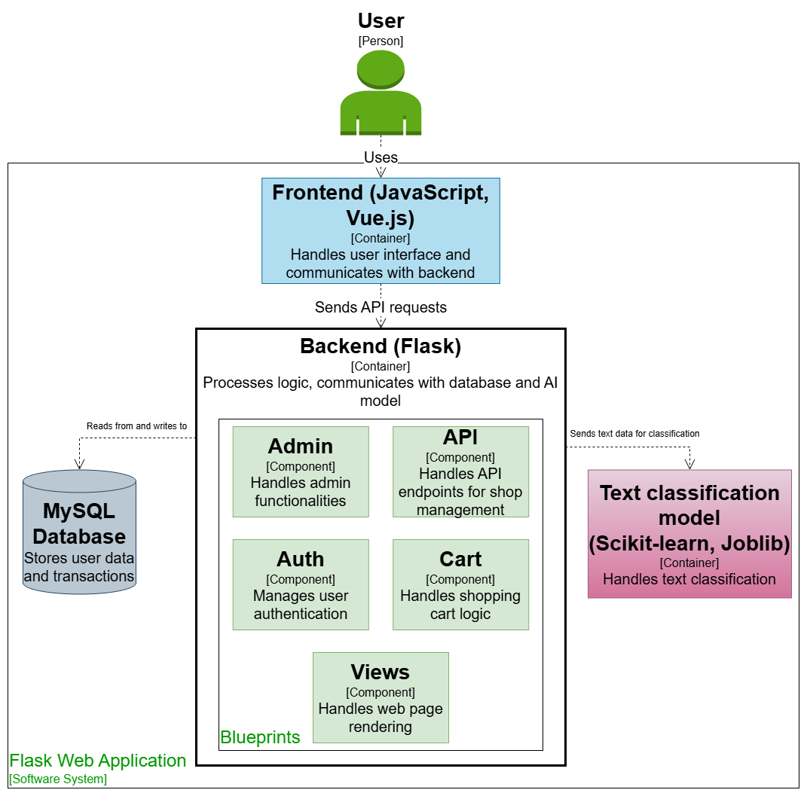

# Shoop-machine-learning
Shoop is a simulated e-commerce platform with a built-in system for automatic sentiment analysis of user comments. Using an ML model, customer reviews are classified as positive, neutral, or negative, allowing the administrator to better respond to consumer behavior.

## Description
Shoop is a web application that simulates an e-commerce platform with all its core functionalities, such as browsing products, adding items to the cart, placing orders, simulating payments, leaving product reviews, creating accounts, and logging in.<br><br>
It features a custom classification model that analyzes user reviews and assigns one of three sentiment ratings: positive, neutral, or negative making process of adding comment automated. The model was trained on Polish reviews from *Opineo.pl* and reviews generated using *LLM-ChatGPT*. Used data is therefore hybrid. It classifies comments into three classes with **85% accuracy**. The training process was performed using the scikit-learn and spaCy libraries. The data was manually prepared, cleaned and balanced.

## Short demonstration video of classification model feature
📽️ [See Demo](https://youtu.be/iIK_0q_B9kE)

## Features
- User account registration
- Account activation via email confirmation
- User login system
- Product search
- Placing orders
- Viewing user orders
- Posting comments **wih automatic rating**
- Admin functionalities: changing user roles, adding products to the store, viewing existing orders

## 🏗 System Architecture
The diagram below presents the high-level architecture of the Shoop e-commerce platform:

To keep the project maintainable and scalable, the application is split into multiple independent modules (Flask blueprints). Each module encapsulates a specific domain of the system.

### Backend Modules (Blueprints)
- admin - management panel for product and user administration
- api - REST API layer used by frontend components and external integrations
- auth - user authentication and session handling
- cart - shopping cart logic, session persistence, price calculations
- views - server-rendered pages and user-facing routes

### Other Core Components
- Text classification model – used for assigning a comment rating
- Database – central data storage for products, users, orders, categories

Text classification model and database are other entities placed on same level as all blueprints together, besides that there are frontend modules structurized with static and templates folders (Flask architecture). In main folder of app there are some Python files helping with configuration, extensions and database handling.

### Frontend Structure
The frontend follows the standard Flask structure with:
- static/ – static assets (JS, CSS, images)
- templates/ – Jinja2 templates used for server-side rendering

### Application Core
- application configuration
- initializing extensions (database, authentication, caching, etc.)
- setting up blueprint registration

### Dataset used to create classification model

I created the dataset myself by downloading real data from *Opineo.pl* and generating artificial opinions using the *ChatGPT* language model (based on real world data), which resulted in a **hybrid dataset**.
The dataset was prepared to ensure security, excellent quality, and usability for the text classification model.

The following **key assumptions** were made when constructing the dataset:
- Even distribution of opinions among three sentiment classes
(positive, neutral, and negative).
- Varying the length of opinions to achieve a more realistic
distribution of texts.
- Eliminating duplicate opinions to ensure the uniqueness
of the dataset.


## Technologies
- Python 3.12.5 – main programming language
- Flask - web framework for backend development
- MySQL, ORM SQLAlchemy - database management and ORM for handling data models
- spacy, scikit-learn - machine learning libraries for text classification and sentiment analysis

## Instalation
### Required Technologies:
- Xampp - server Apache and MySQL
- Visual Studio Code - programming environment
- Python 3.12.5 or newer - to run the application and dependencies
  <br><br>
### Steps to Install:
1. Download xampp, then create new database named: `shoopdb`.
2. Clone repository:
   ```bash
   git clone https://github.com/bartoszstec/Shoop-machine-learning/tree/main
3. Open Visual Studio Code, then open PowerShell and create a new virtual environment:
   ```bash
   python -m venv venv
5. Activate virtual environment and install needed packages:
   ```bash
   venv\Scripts\activate  # On Windows  
   source venv/bin/activate  # On macOS/Linux  
   pip install -r requirements.txt
   ```
6. Create `.env` file in main directory and add configuration:
   ```env
   FLASK_DEBUG=1
   FLASK_APP=app.py
   DATABASE_URL=mysql+pymysql://root:@localhost/shoopdb?charset=utf8mb4
   SECRET_KEY=your_secret_key
   MAIL_USERNAME=your_gmail
   MAIL_PASSWORD=your_password
⚠️ Important: You need a Gmail SMTP account to use this application.

7. After configuring environment you have to create tables in database:
   ```bash
   python create_tables.py
   
## Run application
To run app activate virtual environment and type:
   ```bash
   python app.py
